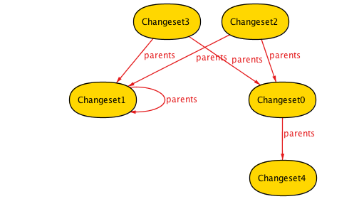
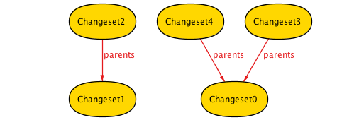
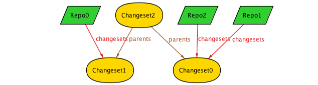
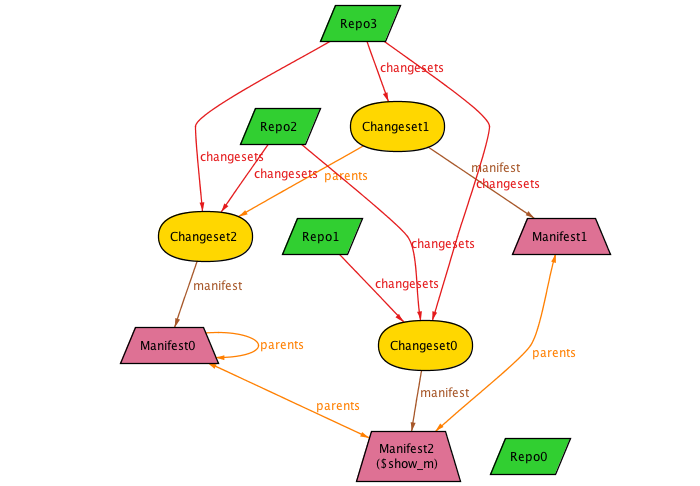
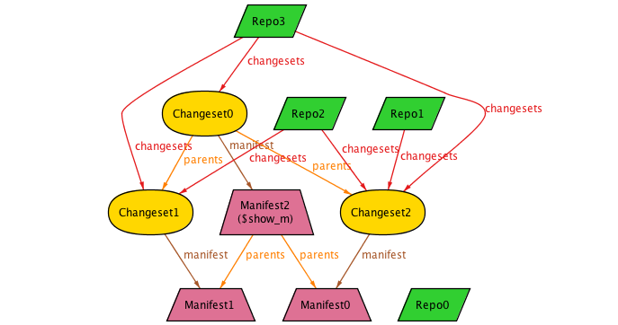

# Modelling Mercurial in Alloy

## Introduction

[Alloy](http://alloytools.org/) is a declarative language for modeling data structures, using relations between sets.
Operations and invariants are all expressed via constraints on the structure.

In this writeup, I'm going to use it to model Mercurial's core data structures. I'm hoping that
by approaching it in a fairly rigourous way I can shine light into the subtle corners and
come up with interesting questions to ask.

This is not intended to be an Alloy tutorial, but I'm learning it myself. This is my writeup
as I progress, so it should be fairly easy to follow along. You can download Alloy from
[here](https://github.com/AlloyTools/org.alloytools.alloy/releases) and load up the sources to
try them out.

## Getting Started - The simplest thing that can possibly work

My first step is to model something that's extremely simple - so simple that I hope there are no questions or unknowns:
- a single repo
- only changesets which can have up to 2 parents

This model has a single (implicit) repo which contains `Changeset`s, each of which can have up to 2 parents.

Here's our initial model:
```
// comments are either like C++
-- or haskell
module mercurial -- declare the module name

-- Define a Changeset
sig Changeset {
    parents: set Changeset -- changeset can have 0 or more parents
}

-- axioms about Changesets
fact {
    all cs: Changeset | #cs.parents <= 2	    -- mercurial allows up to 2 parents
}

-- A helper predicate. This doesn't constrain anything except to keep things interesting
pred show {
    #Changeset >= 5 -- an interesting number of changesets
}

-- Show a random selection of repo configurations which meet the constraints
run show for 10 -- up to 10
```
Let's see some sample outputs:

This looks OK:


Uh, but this isn't what we expect - Mercurial doesn't allow cycles in history, so parents should never point back to themselves:



The problem is that Alloy assumes nothing about our model, so any constraint we want we need to specify. Furthermore, this model is very simple, and just defines a single state of the Repo without any way to modify it - so we can't rely on construction to get the properties we want.

To fix this, we need to extend the axioms to say that its acyclic:
```
fact {
    all cs: Changeset | #cs.parents <= 2	    -- mercurial allows up to 2 parents
    all cs: Changeset | cs not in cs.^parents   -- non-cyclic structure
}
```

The `cs.^parents` means the transitive closure over `parents` - ie, everything we can reach via `parents`. If `cs not in ` everything reachable via parents, then the graph has no cycles.

 

Note that this model still allows multiple disconnected DAGs of changesets. This is fine - so does Mercurial, though it's a little unusual.

## Multiple Repos

OK, we can make reasonable looking repos appear out of thin air, but how do we change them?

Alloy, being declarative, doesn't allow anything to change. Instead what we need to do is instantiate different Repos which represent change over time.

To start, we'll explicitly define a `Repo` which owns `Changeset`s:

```
module mercurial

-- define a Repo which owns a set of Changesets
sig Repo {
    changesets: set Changeset
}

sig Changeset {
    parents: set Changeset
}
{ #parents <=2 } -- shorthand to attach fact about Changeset

fact {
    all cs: Changeset | cs not in cs.^parents -- acyclic
}
```

This produces immediate problems:



We've specified connections between `Repo` and `Changeset`, but we haven't said that *all* `Changeset`s
are connected to some `Repo`.

Let's add another constraint: all Changesets are part of a repo:
```
fact {
    all cs: Changeset | cs in Repo.changesets
}
```
This looks almost OK:


Let's add an assertion to check another assertion: every Changeset reachable from a Repo
is part of that Repo.

```
assert allConnected {
    -- for all Repos, the repo's set of changesets should equal the set of reachable
    -- changesets. `*` is like `^` for transitive closure, but it includes the starting points.
	all r: Repo | r.changesets = r.changesets.*parents
}

check allConnected for 5
```
This defines an assertion which should always be true, and checks its true for all constructions up to 5 elements large. This quickly shows the problem:


Repo1 is connected to Changesets[0..4], but only Changeset0 is in Repo1's changeset. For now, we can add that as another fact:
```
fact {
    all r: Repo | r.changesets = r.changesets.*parents
}
```

## Making Changes

Now that we have multiple Repos, we can use them to represent changes - ie, before and after states.
This means that there's an ordering relationship between Repos.

```
module mercurial

open util/ordering [Repo] -- define an ordering relationship between Repo instances

sig Repo {
    changesets: set Changeset
}

sig Changeset {
    parents: set Changeset
}
{ #parents <= 2 }

-- initial state - an empty Repo
pred init[r: Repo] {
    no r.changesets
}

-- add a commit to repo
pred commit [r, r': Repo, cs: Changeset] {
    r'.changesets = r.changesets + cs -- add cs to next repo
}

-- All sequences of Repos constructable by adding new changesets
fact commits {
    init[first[]] -- initial Repo is empty
    -- for all Repos except for the last one, the difference between it and the next is a commit
    let r: Repo - last [] | let r' = r.next |
        one cs: Changeset | commit[r, r', cs]
}

-- All changesets reachable from a Repo are owned by that Repo
assert csOwned {
    all r: Repo | r.changesets = r.*changesets
}
check csOwned for 5

-- All changesets have an acyclic relationship with their parents
assert csAcyclic {
    all cs: Changeset | cs not in cs.^parents
}
check csAcyclic for 5
```

Now that we're constructing the Repo state incrementally via `commit`, we should be getting
the properties we want by construction rather than making them axioms - so we make them assertions
instead. Unfortunately they fail - we need to add some more preconditions to `commit`.

Firstly, we need to ensure that the `Changeset` we're adding to the Repo isn't already part of the
Repo. And secondly, its parents must be part of the Repo:

```
pred commit [r, r': Repo, cs: Changeset] {
    cs not in r.changesets      -- new cs not part of r
    cs.parents in r.changesets  -- but its parents (if any) must be part of r

    r'.changeset = r.changeset + cs
}
```

Unfortunately, these preconditions are not quite enough - we still need to constrain all Changesets to
being part of a repo:
```
fact {
    all cs: Changeset | cs in Repo.changesets
}
```

(Note that `pred commit` is not changing anything, or assigning anything to `r'`. Rather, it's setting 
constraints on the relationship between `r` and `r'` so when Alloy constructs structures that meet the 
constraints, they have the right properties.)

## Generalizing History

Mercurial uses a common structure for all parts of a repo with history - ie, things with parents such as
Changesets, Manifests and Files - these are all forms of a Node.

We can model this in Alloy:

```
module mercurial
open util/ordering [Repo]

-- A Node is anything with parents. Mercurial allows up to 2.
-- `abstract` means that `Node` can't exist on its own; all instances of Nodes are things
-- that extend it.
abstract sig Node {
    parents: set Node
}
{ #parents <= 2 }

sig Changeset extends Node {
    manifest: Manifest
}
{
    parents in Changeset        -- Changeset parents can only be other Changeset
    this in Repo.changesets     -- all Changesets part of a Repo
}

sig Manifest extends Node {}
{
    parents in Manifest         -- Manifest parents are only other parents
    this in Changeset.manifest  -- all Manifests are referenced by a Changeset
}
```

So now each Changeset has a Manifest, which is also a versioned object with parents. It's also
completely unconstrained, so let's see how that works out:



Ew, the Manifests have parents, but they're completely uncoupled from their corresponding Changsets.
Let's add some more preconditions for `commit`:

```
fun ancestors [n: Node]: set Node {
    n.^parents
}

pred commit [r, r': Repo, cs: Changeset] {
    // Changeset preconditions
    cs not in r.changesets
    cs.parents in r.changesets

    // Manifest preconditions
    -- Manifest's parents must be changeset's parent's manifests 
    cs.manifest.parents = cs.parents.manifest
    -- Manifest must either be new, or from the parents
    cs.manifest in (Manifest - ancestors[cs].manifest + cs.parents.manifest)

    r'.changesets = r.changesets + cs
}
```

OK, so now we constrain Manifests to either being new, or from the parents. And the Manifest's parents must
be the Changeset's parents' Manifests.

Looks good:



Interesting Question: This allows no-op Changesets - ie, the metadata can change with no corresponding
file change. This means that the Manifest is unchanged across Changesets. If this is allowed, then it
means that two changesets can share the same parent, and a changeset that merges them would also have the
same Manifest.  OK, I guess?

Let's assert that all Nodes are acyclic with respect to their parents.

```
assert nodeAcyclic {
    all n: Node | n not in n.^parents
}
check nodeAcyclic for 8
```

Yep, all good.

## Files

TBD