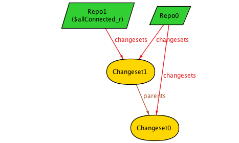

# Modelling Mercurial with Alloy

## Introduction

This is a chronicle of my voyage to build a model of Mercurial in Alloy. The goal is to build
a fairly rigorous model which we can experiment on, and likely find a few surprising things.
Later, we can use it as the basis for evaluating changes to the model.

[Alloy](http://alloytools.org/) is a declarative language for modeling data structures, using 
relations between sets. Operations and invariants are all expressed via constraints on the 
structure; Alloy allows these constraints to be expressed very concisely.

Alloy encourages a very iterative experimental approach. Here, I'm primarily interested in
constructing a model and looking at its output (ie, things that it generates that meet all the
stated constraints) to see if they meet my expectation. If there's something odd in there, it
either means that there's something missing from the model, or perhaps it means that there's are
implications of the model which I didn't anticipate.

This is not intended to be an Alloy tutorial, but I'm learning it myself. This is my writeup
of my learning process, so it should be fairly easy to follow along. You can download Alloy from
[here](https://github.com/AlloyTools/org.alloytools.alloy/releases) and load up the
[sources](https://github.com/jsgf/hg-alloy) to try them out.

### Sidenote - Understanding the Diagrams

I'm using Alloy's built-in tool for visualizing graphs. It doesn't do a great job of laying things out,
but it isn't too bad at this scale (it also supports exporting to dot for somewhat better layout).

Here's a more complex example which has a couple of everything:


We'll get into more detail about what all these mean in detail later on, but broadly:

- `RepoN` is represents an instance of a repository, and is represented by a green parallelogram. Unlike
   everything else, the N is generally meaningful, as Repos have an ordered relationship - increasing N
   represents evolution over time.
- `ChangesetN` represents an instance of a changeset, and is a yellow ellipse
- `ManifestN` is a manifest, represented by a reddish rhombus
- `FileN` is a specific version of a file, in a blue box

(Not shown here are Paths, which every file has. They're omitted here for clarity, but can be shown
with a toggle in the style. Also Repo may not explicitly appear because the display is "projected over Repo" - this
allows diagrams to show progressive change as Repos change.)

Edges between these show how they're related:
- `changesets` shows the relation between a repo and all the changesets it contains. Note that a single changeset
   can be (and often is) part of multiple repos
- `parents` shows an arrow from a child to its parent(s). 
- `manifest` shows the relation between a changeset and its manifest. Every changeset has a manifest, but manifests
  can be shared between changesets
- `files` shows all the files that are part of a manifest

## Getting Started - The simplest thing that can possibly work

My first step is to model something that's extremely simple - so simple that I hope there are no questions or unknowns:
- a single repo
- only changesets which can have up to 2 parents

This model has a single (implicit) repo which contains `Changeset`s, each of which can have up to 2 parents.

Here's our initial model:
```
// comments are either like C++
-- or haskell
module mercurial -- declare the module name

-- Define a Changeset
sig Changeset {
    parents: set Changeset -- changeset can have 0 or more parents
}

-- facts (axioms) about Changesets
fact {
    all cs: Changeset | #cs.parents <= 2	    -- mercurial allows up to 2 parents
}

-- A helper predicate. This doesn't constrain anything except to keep things interesting
pred show {
    #Changeset >= 5 -- an interesting number of changesets
}

-- Show a random selection of repo configurations which meet the constraints
run show for 10 -- up to 10
```
Let's see some sample outputs:

This looks OK:


Uh, but this isn't what we expect - Mercurial doesn't allow cycles in history, so parents should never point back to themselves:


The problem is that Alloy assumes nothing about our model, so any constraint we want we need to specify. Furthermore, this model is very simple, and just defines a single state of the Repo without any way to modify it - so we can't rely on construction to get the properties we want.

To fix this, we need to extend the facts to explicitly say that its acyclic:
```
fact {
    all cs: Changeset | #cs.parents <= 2        -- mercurial allows up to 2 parents
    all cs: Changeset | cs not in cs.^parents   -- non-cyclic structure
}
```

The `cs.^parents` means the transitive closure over `parents` - ie, everything we can reach via `parents`. If `cs not in ` everything reachable via parents, then the graph has no cycles.

 

Note that this model still allows multiple disconnected DAGs of changesets. This is fine - so does Mercurial, though it's a little unusual.

## Multiple Repos

OK, we can make reasonable looking repos appear out of thin air, but how do we change them?

Alloy, being declarative, doesn't allow anything to change. Instead what we need to do is instantiate different Repos which represent change over time.

To start, we'll explicitly define a `Repo` which owns `Changeset`s:

```
module mercurial

-- define a Repo which owns a set of Changesets
sig Repo {
    changesets: set Changeset
}

sig Changeset {
    parents: set Changeset
}
{ #parents <=2 } -- shorthand to attach fact about Changeset

fact {
    all cs: Changeset | cs not in cs.^parents -- acyclic
}
```

This produces immediate problems:


We've specified connections between `Repo` and `Changeset`, but we haven't said that *all* `Changeset`s
are connected to some `Repo`.

Let's add another constraint: all Changesets are part of a repo:
```
fact {
    all cs: Changeset | cs in Repo.changesets
}
```
This looks almost OK:


Let's add an assertion to check another assertion: every Changeset reachable from a Repo
is part of that Repo.

```
assert allConnected {
    -- for all Repos, the repo's set of changesets should equal the set of reachable
    -- changesets. `*` is like `^` for transitive closure, but it includes the starting points.
    all r: Repo | r.changesets = r.changesets.*parents
}

check allConnected for 5
```
This defines an assertion of an invariant, and checks its true for all constructions up to 5 elements large. This quickly shows the problem:



Changesets 0 and 1 have a parent/child relationship. Repo 0 owns them, but Repo 1 only has Changeset 1, not 0.

Let's fix that for now by just making it a fact:
```
fact {
    -- for every existing Repo, the changesets set must be the same as a all the changesets reachable from that set
    all r: Repo | r.changesets = r.changesets.*parents
}
```

## Making Changes

Now that we have multiple Repos, we can use them to represent changes - ie, before and after states.
We can build up a Repo's state inductively: starting from an initial empty Repo, we can keep
adding new Changesets via commit operations. This implies that Repos have an ordering relationship,
which we can use Alloy's built-in `util/ordering` module to implement.

```
module mercurial

open util/ordering [Repo] -- define an ordering relationship between Repo instances

sig Repo {
    changesets: set Changeset
}

sig Changeset {
    parents: set Changeset
}
{ #parents <= 2 }

-- initial state - an empty Repo
pred init[r: Repo] {
    no r.changesets
}

-- add a commit to repo
pred commit [r, r': Repo, cs: Changeset] {
    r'.changesets = r.changesets + cs -- add cs to next repo
}

-- All sequences of Repos constructable by adding new changesets
fact commits {
    init[first[]] -- initial Repo is empty
    -- for all Repos except for the last one, the difference between it and the next is a commit
    let r: Repo - last [] | let r' = r.next |
        one cs: Changeset | commit[r, r', cs]
}

-- All changesets reachable from a Repo are owned by that Repo
assert csOwned {
    all r: Repo | r.changesets = r.*changesets
}
check csOwned for 5

-- All changesets have an acyclic relationship with their parents
assert csAcyclic {
    all cs: Changeset | cs not in cs.^parents
}
check csAcyclic for 5
```

Now that we're constructing the Repo state incrementally via `commit`, we should be getting
the properties we want by construction rather than making them `fact`s...

Um, no:


We're still getting loops, and we're not adding new changesets on each `commit`.

We need to add some more preconditions to `commit`.
Firstly, we need to ensure that the `Changeset` we're adding to the Repo isn't already part of the
Repo. And secondly, its parents must be part of the Repo:

```
pred changesetPrecond[r: Repo, cs: Changeset] {
	cs not in r.changesets -- new cs not already in repo
	cs.parents in r.changesets -- cs's parents are in repo
}

pred commit [r, r': Repo, cs: Changeset] {
    changesetPrecond[r, cs]

    r'.changeset = r.changeset + cs
}
```

(Note that the lines in the predicate are treated as logically-ANDed together. The final line isn't an
assignment or imperative - it's just a constraint on the relationship between `r` and `r'`.)

Unfortunately, these preconditions are not quite enough - we still need to constrain all Changesets to
being part of a repo:


That can be a `fact`.
```
fact {
    all cs: Changeset | cs in Repo.changesets
}
```


## Generalizing History

Mercurial uses a common structure for all parts of a Repo with history (ie, things with parents)
are all Nodes - Changesets, Manifests and Files are all types of Node.

We can model this in Alloy:

```
module mercurial
open util/ordering [Repo]

-- A Node is anything with parents. Mercurial allows up to 2.
-- `abstract` means that `Node` can't exist on its own; all instances of Nodes are things
-- that extend it.
abstract sig Node {
    parents: set Node
}
{ #parents <= 2 }

sig Changeset extends Node {
    manifest: Manifest
}
{
    parents in Changeset        -- Changeset parents can only be other Changeset
    this in Repo.changesets     -- all Changesets part of a Repo
}

sig Manifest extends Node {}
{
    parents in Manifest         -- Manifest parents are only other parents
    this in Changeset.manifest  -- all Manifests are referenced by a Changeset
}
```

So now each Changeset has a Manifest, which is also a versioned object with parents. It's also
completely unconstrained, so let's see how that works out:


Ew, the Manifests have parents, but they're completely uncoupled from their corresponding Changesets.
(Not to mention Manifest0's self parenthood, and Manifest1 and 2's mutual parenthood.)

Let's add some more preconditions for `commit`:

```
-- Helper function to return the set of ancestors for a particular Node.
fun ancestors [n: Node]: set Node {
    n.^parents
}

pred manifestPrecond[cs: Changeset] {
	cs.manifest in ((Manifest - ancestors[cs].manifest) + cs.parents.manifest) -- manifest can't be reused from ancestors except parents
	cs.manifest.parents = cs.parents.manifest -- manifest has cs's parents manifests
	-- if we have parents, at least one of them has to have a different file set
	some cs.manifest.parents => some mp: cs.manifest.parents | mp.files != cs.manifest.files
}

pred commit [r, r': Repo, cs: Changeset] {
    changesetPrecond[r, cs]
    manifestPrecond[cs]

    r'.changesets = r.changesets + cs
}
```

OK, so now we constrain Manifests to either being new, or from the parents. And the Manifest's parents must
be the Changeset's parents' Manifests.

Looks good:


Interesting Question: This allows no-op Changesets - ie, the metadata can change with no corresponding
file change. This means that the Manifest is unchanged across Changesets. If this is allowed, then it
means that two changesets can share the same parent, and a changeset that merges them would also have the
same Manifest.  OK, I guess?

Now that we're incrementally constructing the Repo state, and each commit has a set of local constraints
for Changesets as they're being added, we can check some assertions for global invariants that we expect
to hold over multiple commits:

```
-- All Nodes are acyclic with respect to their parents (covers Changesets, Manifests, Files)
assert nodeAcyclic {
    all n: Node | n not in n.^parents
}
check nodeAcyclic for 8 -- up to 8 of any top level thing

-- Manifest's parents are their Changeset's parents' Manifests
assert manifestParents {
	all cs: Changeset | cs.manifest.parents = cs.parents.manifest
}
check manifestParents for 8 but 12 Node -- allow more Nodes because each cs uses at least 2

-- Manifests aren't suddenly reused with respect to their history
-- (Disjoint history is allowed to reuse manifests?)
assert noManifestReuse {
	all cs: Changeset | cs.manifest in (Manifest - (cs::ancestors[].manifest) + cs.parents.manifest)
}
check noManifestReuse for 8 but 12 Node
```

Yep, all good.

## Files

Extending the model to include files is relatively straightforward - they're just another extension of `Node`:

```
sig Manifest extends Node {
    files: set File,            -- set of files we've got
}
{
    parents in Manifest         -- Manifest parents are only other parents
    this in Changeset.manifest  -- all Manifests are referenced by a Changeset
}

-- File extends Node, and has a Path
sig File extends Node {
    path: Path
}
{
    parents in File             -- file parents are files
    this in Manifest.files      -- all files referenced by a manifest
}

sig Path {} -- atom representing a distinct path in a Manifest
```

Let's see what happens with that:


Well, there's a couple of problems here:
- The Manifests have multiple files with the same name
- The file histories are nonsense

The multiple files with duplicate names are fairly easy to fix up:
```
fact {
    -- For all manifests, if two files have the same path, then they're the same file
    all m: Manifest | all f, f': m.files | f.path = f'.path => f = f'
}
```

But we need yet more constraints on `commit` to get the histories right. Firstly, file histories are all
per `Path`, so the parent of a file must have the same path. It also has to be in a parent's Manifest.
Also for it to be a "history", at least one of the parents has to be a different file:

```
pred filesPrecond[cs: Changeset] {
	-- a file's parents must be: 1. in the parent manifest, 2. have the same path
	all f: cs.manifest.files | all fp: File |
		fp in f.parents iff (fp in cs.manifest.parents.files and fp.path = f.path)
	-- At least one of the parents has to be different from f
	all f: cs.manifest.files |
		some f.parents => some fp: f.parents | fp != f
}

// commit adds a new changeset to a repo
pred commit [r, r': Repo, cs: Changeset] {
	-- preconditions
	changesetPrecond[r, cs]
	manifestPrecond[cs]
	filesPrecond[cs]

	r'.changesets = r.changesets + cs -- add cs to r'
}
```

This looks better, but there's still an issue:


We have two manifests with the same content and the same parents. In Mercurial these would be the same object,
so we can make the same constraint here:

```
fact {
    -- If two Manifests have the same parents and files, then they're the same manifest
    all m, m': Manifest | m.files = m'.files and m.parents = m'.parents => m = m'
}
```

With this constraint in place, we get plausible-looking output like:


# Conclusion (for now)

So now we have:
- a model for the traditional version Mercurial's core data structure (flat manifests)
- a commit operation, along with a set of concise preconditions
- assertions for invariants that follow from the commit operation and its preconditions

This is a pretty good start, and has already been a useful exercise for my understanding of Mercurial.

But there's more to do - we're missing:
- any model of the working directory, or editing files
- how the working directory gets turned into a commit while meeting the preconditions
- models for operations like rebase, trivial (push) rebase, etc
  - though `commit` is general enough to express branching and merging

But those are for next time.
